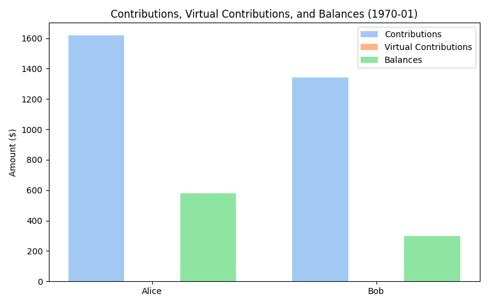
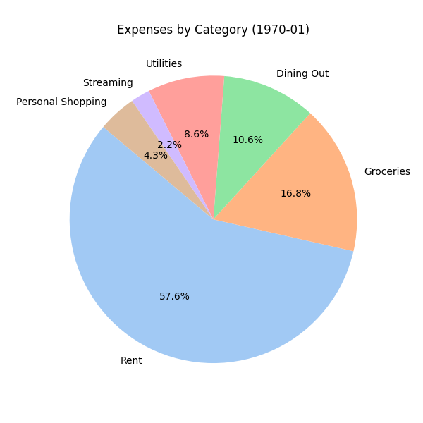

💰 Shared Expenses Report – 1970-01
======================================

| Item                       | Amount ($) |
|----------------------------|------------|
| Total Shared Expenses      | 2165.00 |
| Each Person Owes           | 1082.50 |
| Account Balance change     | 875.00 |

#### Paid Toward Shared
| Name   | Amount ($) |
|--------|------------|
| Alice | 1620 |
| Bob | 1420 |

#### Virtual Contributions Toward Shared
No virtual contributions recorded.

#### Balances
| Name   | Balance ($) | Status    |
|--------|-------------|-----------|
| Alice | 537.50 | overpaid |
| Bob | 337.50 | overpaid |

---
#### Expenses by Category
| Category           | Amount ($) |
|--------------------|------------|
| Rent | 1200.00 |
| Groceries | 350.00 |
| Dining Out | 220.00 |
| Utilities | 180.00 |
| Streaming | 45.00 |
| Personal Shopping | 90.00 |
| Household Items | 80.00 |

---
Full list of contributions:
  - Date: 2025-06-01, Name: Alice, Amount: 1000, Virtual Contribution: No, Notes: Monthly contribution
  - Date: 2025-06-01, Name: Bob, Amount: 1000, Virtual Contribution: No, Notes: Monthly contribution
  - Date: 2025-06-15, Name: Bob, Amount: 75, Virtual Contribution: No, Notes: Extra payment to cover shortfall

Full list of payments:
  - Date: 2025-06-01, Category: Rent, Paid By: Both, Amount: 1200, Shared: Yes, Notes: Split evenly
  - Date: 2025-06-03, Category: Groceries, Paid By: Alice, Amount: 350, Shared: Yes, Notes: Weekly groceries
  - Date: 2025-06-05, Category: Dining Out, Paid By: Bob, Amount: 220, Shared: Yes, Notes: 3 dinners
  - Date: 2025-06-08, Category: Utilities, Paid By: Alice, Amount: 180, Shared: Yes, Notes: Internet & electricity
  - Date: 2025-06-10, Category: Streaming, Paid By: Bob, Amount: 45, Shared: Yes, Notes: Netflix & Spotify
  - Date: 2025-06-12, Category: Personal Shopping, Paid By: Alice, Amount: 90, Shared: No, Notes: Not shared
  - Date: 2025-06-15, Category: Household Items, Paid By: Bob, Amount: 80, Shared: Yes, Notes: Cleaning
