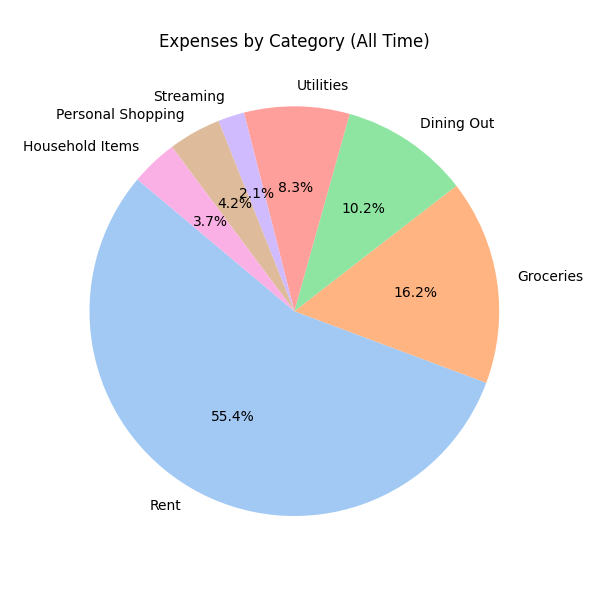

# Overview Report

| Month | Account Balance | Contributions | Virtual Contributions | Balances |
|-------|-----------------|---------------|-----------------------|----------|
| 1970-01 | $875.00 | Alice: $1620.00, Bob: $1420.00 |  | Alice: $537.50, Bob: $337.50 |
| **Total** | $875.00 | Alice: $1620.00, Bob: $1420.00 |  | Alice: $537.50, Bob: $337.50 |

## Expenses by Category (All Time)

- Rent: $1200.00
- Groceries: $350.00
- Dining Out: $220.00
- Utilities: $180.00
- Streaming: $45.00
- Personal Shopping: $90.00
- Household Items: $80.00

